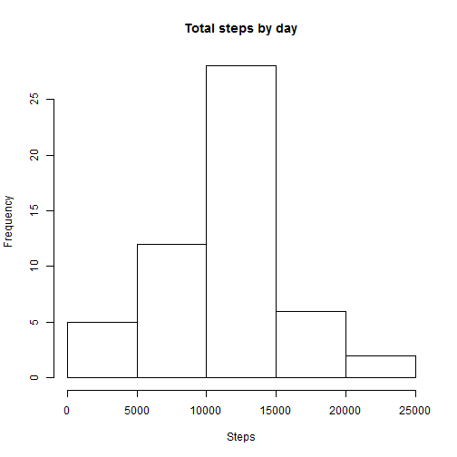
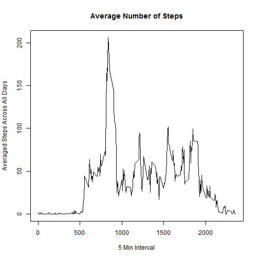
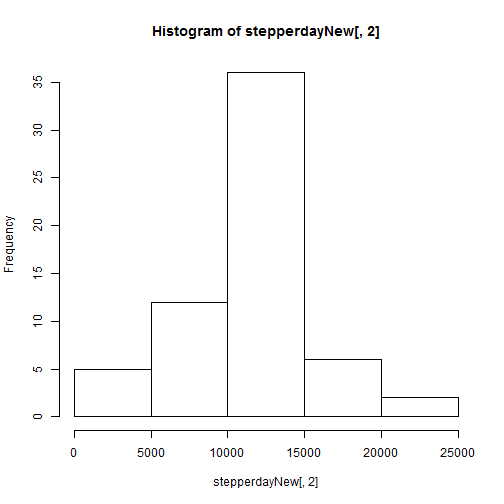
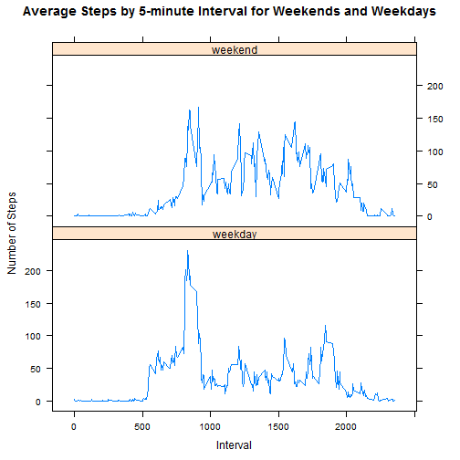

#Loading and preprocessing the data
Show any code that is needed to
1.Load the data (i.e. read.csv())
2.Process/transform the data (if necessary) into a format suitable for your analysis

```r
activity=read.csv("activity.csv",header=T)
attach(activity) 
head(activity)
```

```
##   steps       date interval
## 1    NA 2012-10-01        0
## 2    NA 2012-10-01        5
## 3    NA 2012-10-01       10
## 4    NA 2012-10-01       15
## 5    NA 2012-10-01       20
## 6    NA 2012-10-01       25
```

#What is mean total number of steps taken per day?
1.Calculate the total number of steps taken per day

```r
stepperday=aggregate(steps~date, sum, data=activity)
head(stepperday)
```

```
##         date steps
## 1 2012-10-02   126
## 2 2012-10-03 11352
## 3 2012-10-04 12116
## 4 2012-10-05 13294
## 5 2012-10-06 15420
## 6 2012-10-07 11015
```

2.Make a histogram of the total number of steps taken each day

```r
hist(stepperday[,2], main="Total steps by day", xlab = "Steps")
```

 

3.Calculate and report the mean and median of the total number of steps taken per day

```r
mean(stepperday[,2])
```

```
## [1] 10766.19
```

```r
median(stepperday[,2])
```

```
## [1] 10765
```

#What is the average daily activity pattern?
1.Make a time series plot (i.e. type = "l") of the 5-minute interval (x-axis) and the average number of steps taken, averaged across all days (y-axis)

```r
stepperIntv=aggregate(steps~interval, mean, data=activity)
plot(stepperIntv[,1],stepperIntv[,2],type = "l",main="Average Number of Steps", xlab="5 Min Interval", ylab="Averaged Steps Across All Days")
```

 

2.Which 5-minute interval, on average across all the days in the dataset, contains the maximum number of steps?

```r
stepperIntv[,1][which(stepperIntv[,2]==max(stepperIntv[,2]))]
```

```
## [1] 835
```


#Imputing missing values

1.Calculate and report the total number of missing values in the dataset (i.e. the total number of rows with NAs)

```r
sum(is.na(steps))
```

```
## [1] 2304
```
2.Devise a strategy for filling in all of the missing values in the dataset. 

-I will use the mean for that 5-minute interval.

3.Create a new dataset that is equal to the original dataset but with the missing data filled in.

```r
#create a new data set
activityNew=activity
stepperIntvNew=aggregate(steps~interval, mean, data=activityNew)
#for every interval, calculate mean and replace NA with the mean
for (i in stepperIntvNew[,1]){
     #find out how many are missing for one time interval
     lengthmissing=length(activityNew[is.na(activityNew$steps)&activityNew$interval==i,][,1])
     activityNew[is.na(activityNew$steps)&activityNew$interval==i,][,1]=rep(stepperIntvNew[,2][stepperIntvNew[,1]==i],lengthmissing)
    }
```

4.Make a histogram of the total number of steps taken each day and Calculate and report the mean and median total number of steps taken per day. 

```r
stepperdayNew=aggregate(steps~date, sum, data=activityNew)
hist(stepperdayNew[,2])
```

 

```r
mean(stepperdayNew[,2])
```

```
## [1] 10766.19
```

```r
median(stepperdayNew[,2])
```

```
## [1] 10766.19
```
Do these values differ from the estimates from the first part of the assignment?    
- Mean is the same but median is slightly different    
What is the impact of imputing missing data on the estimates of the total daily number of steps?  
- For days with intervals missing, the total daily steps would increase.   
- For days with no intervals missing, the total daily steps would remain the same.   

#Are there differences in activity patterns between weekdays and weekends? 
1. Create a new factor variable in the dataset with two levels - "weekday" and "weekend" indicating whether a given date is a weekday or weekend day.  

```r
#add a new column to indicate days of the week
activityNew$week=weekdays(as.Date(activityNew$date))
#in the new column, change days of week to weekday or weekend
for (i in 1:length(activityNew$week)){
  if (activityNew$week[i] == "Saturday" || activityNew$week[i] == "Sunday"){
    activityNew$week[i] = "weekend"
  }else{ activityNew$week[i] = "weekday"}
}
#change the new column to factor
activityNew$week=as.factor(activityNew$week)
```

2. Make a panel plot containing a time series plot (i.e. type = "l") of the 5-minute interval (x-axis) and the average number of steps taken, averaged across all weekday days or weekend days (y-axis).  

```r
library(ggplot2)
library(lattice)
#aggregate by interval and week
stepperIntvNew=aggregate(steps~interval+week, mean, data=activityNew)
xyplot(steps ~ interval | week, data = stepperIntvNew, 
       type = "l", layout = c(1,2), xlab = "Interval", ylab = "Number of Steps", 
       main = "Average Steps by 5-minute Interval for Weekends and Weekdays")
```

 
